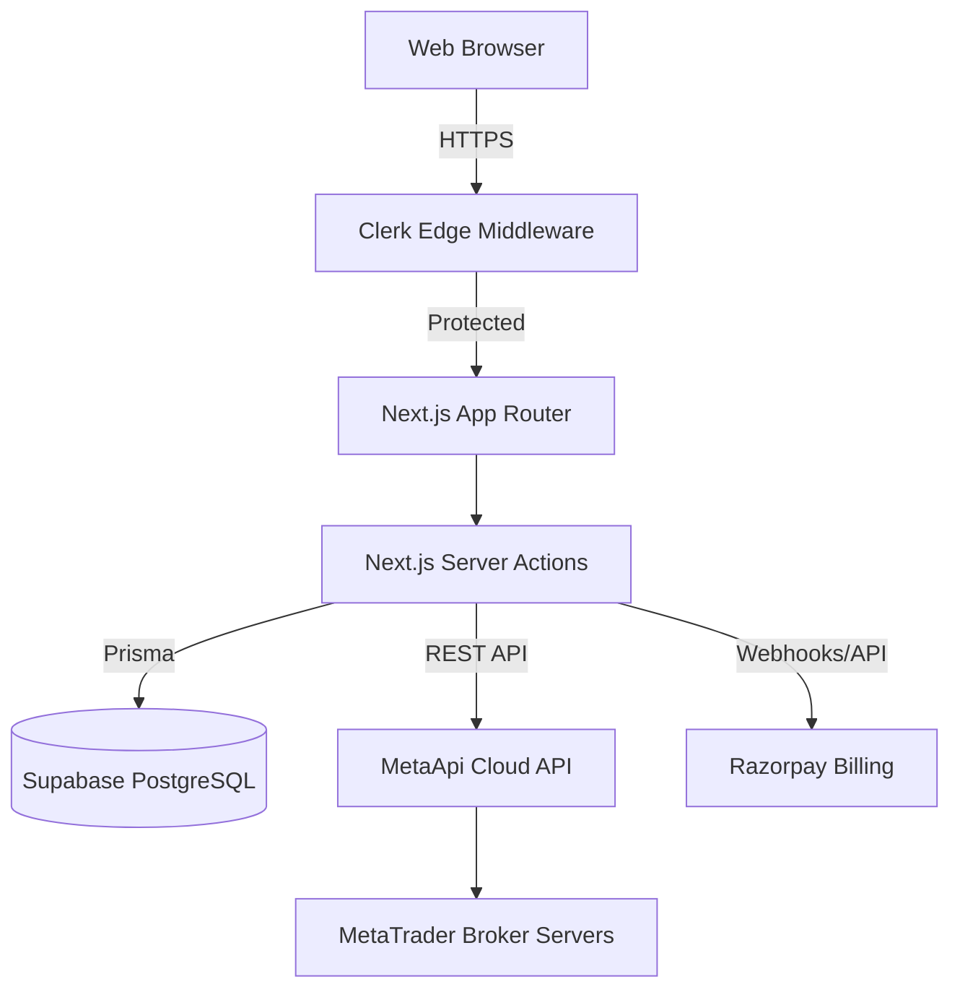

# Architecture Diagram

```mermaid
graph TD
    Client[Web Browser] -->|HTTPS| Middleware[Clerk Edge Middleware]
    Middleware -->|Protected| Frontend[Next.js App Router]
    Frontend --> ServerActions[Next.js Server Actions]
    
    ServerActions -->|Prisma| DB[(Supabase PostgreSQL)]
    ServerActions -->|REST API| MetaApi[MetaApi Cloud API]
    ServerActions -->|Webhooks/API| Stripe[Razorpay Billing]
    
    MetaApi --> Broker[MetaTrader Broker Servers]
```
